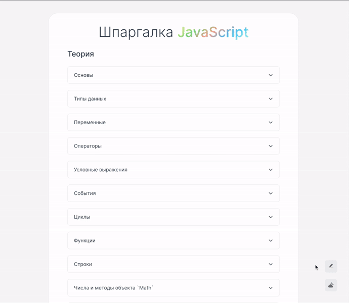
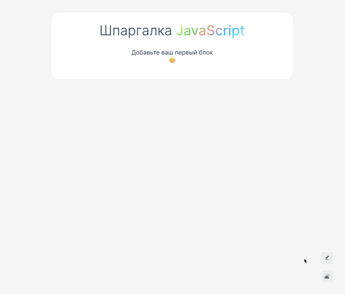

<!-- prettier-ignore-start -->

# Учебный проект Cheat Sheet JavaScript

[](/README.en.md)
[](/README.ru.md)

Данный учебный проект был разработан для отработки знаний React.

Визуализация:



## Описание

Мой второй учебный проект с использованием библиотеки React. Идея для данного проекта возникла, когда пришло осознание того, что часто приходится обращаться к сайтам типа MDN для получения информации в ходе написания кода. Было принято разработать решение, в котором я сам смогу вписывать информацию помимо имеющейся.

## Для запуска

Необходимо установить зависимости находясь в корневой папке проекта:

```bash
npm install
```

Запустить приложение локально находясь в корневой папке проекта:

```bash
npm start
```

## Что умеет приложение

#### Отображение информации в виде аккордеонов и элементов внутри

В данном случае текстовая информация приложения хранится в JSON формате на Frontend части приложения.

#### Изменение цветовой темы

Функция изменения цветовой темы по кнопке.

#### Режим изменения информации



В данном режиме приложение внутри интерфейса позволяет менять информацию (Для простоты реализации, данные храняться в localStorage :smile:)

Функционал:

1. Возможность добавлять блоки, аккордионы
2. Добавлять теги внутри аккордиона:
   - h4
   - p
   - code
3. Позволяет удалять блок с аккордионами
4. Позволяет удалять аккордионы внутри блока
<!-- prettier-ignore-end -->
